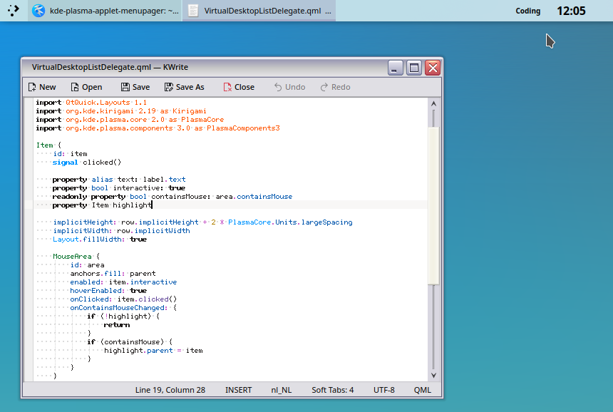
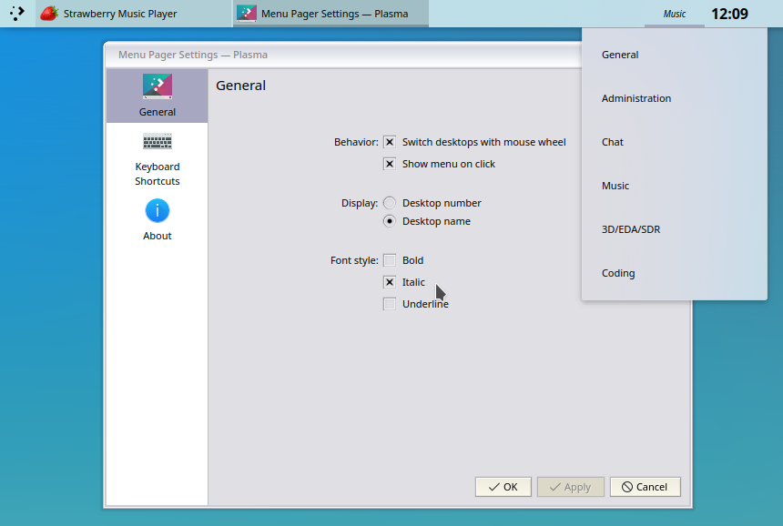
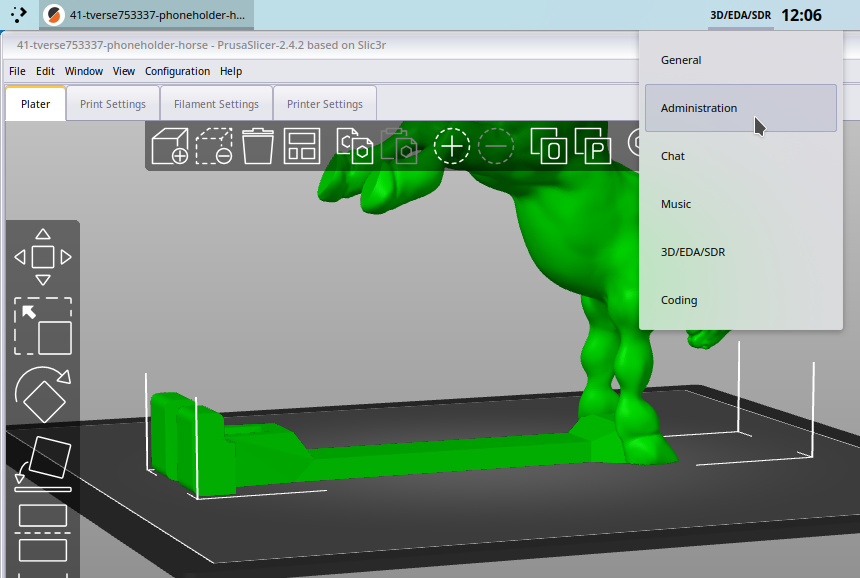

# kde-plasma-applet-menupager

_Switch between virtual desktops using a menu._

I tried Plasma activities and I loved its power, but I settled on using Plasma's virtual desktops as it is unlikely to ever [disappear](https://invent.kde.org/plasma/plasma-workspace/-/issues/35) and is well integrated and supported throughout Plasma. However, I liked the mental separation of context that _activities_ provides and not just extra window real estate. In other words, virtual desktops can be used like that but I want to always see visually in which ~activity~ _virtual desktop_ I currently am.

So, I created a nifty simple menu/mouse wheel pager to do just this:


### Requirements
This Plasma applet has been tested with Plasma 5.25.

It may or may not work on (much) older Plasma versions!

### Installation
1. Right click on your desktop, `Add Widgets...`
2. `Get New Widgets...`
3. `Download New Plasma Widgets`
4. Search "`Menu Pager`" and hit `Install`, or get it manually [here](https://store.kde.org/p/1898708/).

You can also grab the tarball and install manually:
```
kpackagetool5 -i kde-plasma-applet-menupager-0.1.tar.gz
```

### Screenshots






